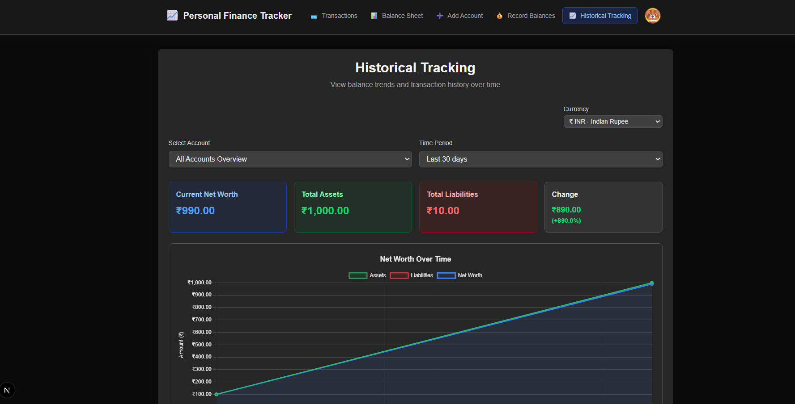

# Personal Finance Tracker — Next.js App 💸

A compact, privacy-first personal finance tracker built with Next.js and TypeScript. Track accounts, balances, transactions, and net worth, with optional cloud sync when you want it.

It is offline-first by default, so data stays in the browser unless you enable syncing. Auth0 is used for authentication when cloud features are on.



## Features

- **Accounts & Balances:** Add accounts, record balances, and manage multiple currencies.
- **Transactions:** Log income and expenses in the main tracker.
- **Balance Sheet:** Keep the separate balance-sheet view for accounts and net worth.
- **Charts & History:** View net worth and historical trends with interactive charts.
- **Bank Statements:** Upload bank statements for quicker entry.
- **Offline First:** Use local storage by default, with optional cloud sync.
- **Auth0 & Cloud:** Sign in with Auth0 when cloud sync is enabled.
- **Settings:** Adjust app preferences, currency, theme, and privacy options.

## Setup

1. Clone the repo.
```bash
git clone https://github.com/sahalhes/fintrack
cd fintrack
```
2. Install dependencies.
```bash
npm install
```
3. Start the app.
```bash
npm run dev
```

The app works offline by default with localStorage.

### Optional: Enable Cloud Sync & Authentication

To enable cloud sync:

1. Set up MongoDB.
2. Set up Auth0.
3. Add the env vars below.
4. Set `NEXT_PUBLIC_AUTH0_ENABLED=true`.

### Auth0 Setup

Create a Regular Web Application in [Auth0](https://auth0.com/) and set:

- Callback URL: `http://localhost:3001/auth/callback`
- Logout URL: `http://localhost:3001/`
- Web Origin: `http://localhost:3001`

Save the domain, client ID, and client secret.

### MongoDB Setup

Use local MongoDB or MongoDB Atlas.

## Environment Variables

Create `.env.local` and add:

```env
# Analytics (public)
NEXT_PUBLIC_GA_TRACKING_ID=G-XXXXXXXXXX
NEXT_PUBLIC_ENABLE_ANALYTICS=false

# Auth0 (server-side secrets must be kept secret)
AUTH0_SECRET=your-auth0-secret
AUTH0_CLIENT_SECRET=your-auth0-client-secret
AUTH0_DOMAIN=your-domain.auth0.com
AUTH0_CLIENT_ID=your-auth0-client-id
APP_BASE_URL=http://localhost:3001
# Enable Auth0 UI only after Auth0 is configured and working
NEXT_PUBLIC_AUTH0_ENABLED=false

# MongoDB
DATABASE_URL=mongodb://localhost:27017/fintrack
MONGODB_DB_NAME=fintrack
```

> If Auth0/MongoDB are not set up, the app stays offline-only.

## Usage

- Run in development: `npm run dev`
- Build for production: `npm run build`
- Start production server: `npm start`

After login, use the app to add accounts, record balances, and log transactions.

## Cloud Sync ☁

Turn on `Cloud Sync` in `/settings` after configuring Auth0 and MongoDB. Data is stored as one JSON record per user.

## Contributing

Contributions are welcome. Keep changes small, follow the existing TypeScript and React patterns, and run linting before opening a PR.

## Reporting Issues

Open an issue with a clear title, steps to reproduce, and expected vs actual behavior. For security issues, contact the repo owner directly.

## Known Limitations

- Charts and balance calculations assume regular manual entries.
- Cloud sync is intentionally simple and best treated as a convenience.

## Google Analytics

GA4 tracking is included for product usage insights only. See [ANALYTICS.md](ANALYTICS.md).

## Todo
- [ ] Cloudflare
- [ ] AI summary and insights

## License

This project is licensed under the MIT License.

